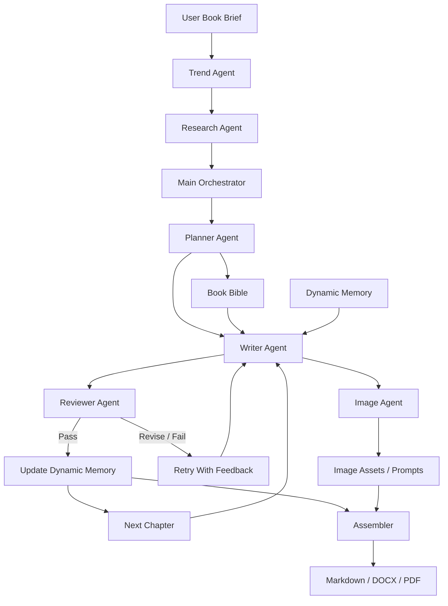
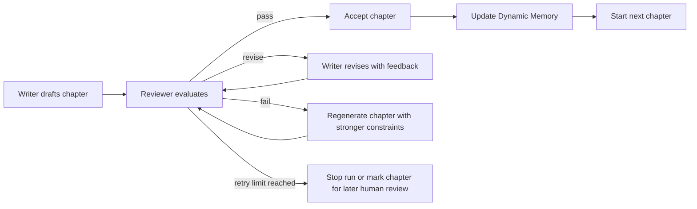
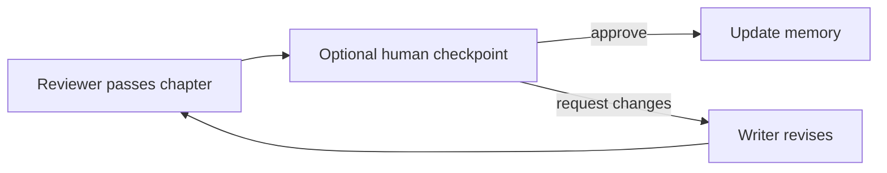

# Autonomous Book-Writing Agent Architecture

## 1. Goal

The goal is to build an autonomous content-writing system that can generate a short book of roughly 30 pages for the first version, while keeping the architecture ready to scale into longer books, richer research, human review, and more advanced publishing workflows later.

The first version should be backend-first and Python-oriented. It should run as an autonomous pipeline: the user provides a book idea or topic, the system researches it, plans the book, writes chapters, reviews and revises them, updates memory, optionally generates image assets, and finally assembles the book into Markdown, DOCX, and PDF.

The system should not begin as a large product platform. The MVP should focus on producing a coherent book reliably.

## 2. High-Level Architecture

The architecture follows the flow from the original sketch:



The key idea is that the `Main Orchestrator` owns the state machine. Individual agents should not independently decide the whole workflow. Each agent performs one responsibility and returns structured output that the orchestrator validates before moving to the next step.

## 3. MVP Scope

The MVP should support:

- A single book project at a time.
- Approximately 30 pages of final content.
- Fully autonomous generation by default.
- Research-assisted planning and writing.
- A planner-generated book structure.
- Chapter-by-chapter writing.
- Automated review and retry loops.
- Dynamic memory updates after every accepted chapter.
- Optional image planning or image generation hooks.
- Final export to Markdown, DOCX, and PDF.

The MVP should not require:

- A web dashboard.
- Multi-user collaboration.
- A database.
- Real-time editing.
- Complex publishing templates.
- Human approval gates during generation.

Human-in-loop review should be designed as a later extension, not required for v1.

## 4. Core Components

### 4.1 Main Orchestrator

The orchestrator is the control center of the system. It manages state, routing, retries, validation, and the order of execution.

Responsibilities:

- Create and maintain the book generation run state.
- Call agents in the correct order.
- Pass only the required context to each agent.
- Validate structured outputs.
- Decide whether a chapter passed review or needs revision.
- Stop after retry limits are reached.
- Trigger memory updates.
- Trigger final assembly.
- Record errors and intermediate artifacts for debugging.

Recommended implementation style:

- Use a graph or state-machine architecture.
- A framework like LangGraph is a good fit if the project uses agent graphs.
- A custom orchestrator is also acceptable for the MVP if it keeps the state transitions explicit.

The orchestrator should be deterministic wherever possible. Agents can generate content, but workflow control should remain predictable.

### 4.2 Trend Agent

The Trend Agent identifies current demand signals around the topic.

Responsibilities:

- Fetch trend signals from sources such as Google Trends or another trends API.
- Extract related keywords, rising searches, and audience interest patterns.
- Provide topic angles that may improve relevance.
- Pass structured trend insights to the Research Agent and Planner Agent.

MVP behavior:

- Trend data can be optional if no trend API is available.
- The system should still work from the user brief alone.

### 4.3 Research Agent

The Research Agent gathers and condenses source material.

Responsibilities:

- Search for useful articles, papers, public references, or web sources.
- Strip irrelevant page content.
- Summarize useful findings into research notes.
- Extract claims, examples, definitions, statistics, and source URLs.
- Mark uncertainty when a source is weak or a claim needs caution.
- Produce research material that can be fed into the Planner and Writer.

Output should be stored as structured research notes, not only raw text. A good research note should include:

- Topic or keyword.
- Summary.
- Important facts.
- Potential book angles.
- Source URL.
- Source title.
- Retrieval date.
- Reliability notes.

### 4.4 Planner Agent

The Planner Agent creates the "soul" of the book.

Responsibilities:

- Define the core thesis of the book.
- Define the target reader persona.
- Define the promise of the book.
- Choose tone, style, and reading level.
- Create the book outline.
- Define chapter goals.
- Define what each chapter must cover.
- Define continuity rules so chapters connect cleanly.
- Define image opportunities if relevant.

The Planner Agent should create the Book Bible. This is the stable source of truth for the rest of the run.

The Book Bible should include:

- Working title.
- Subtitle ideas.
- Core thesis.
- Target audience.
- Reader pain points or desires.
- Book promise.
- Tone and style guide.
- Chapter outline.
- Chapter summaries.
- Required themes.
- Forbidden topics or claims.
- Glossary of recurring terms.
- Citation expectations.
- Image direction.

### 4.5 Writer Agent

The Writer Agent writes the actual book content.

Responsibilities:

- Write one chapter at a time.
- Follow the Book Bible.
- Use relevant research notes.
- Use Dynamic Memory to maintain continuity.
- Respect target word count and chapter purpose.
- Avoid repeating previous chapters.
- Include placeholders for images where useful.
- Produce clean Markdown.

The Writer Agent should not be asked to write the entire book in one call. Chapter-level generation is easier to review, revise, and debug.

Each chapter draft should include:

- Chapter title.
- Chapter body.
- Optional section headings.
- Key takeaways if appropriate for the genre.
- Image placeholder notes if needed.
- Citation markers or source notes when research-backed claims are used.

### 4.6 Reviewer Agent

The Reviewer Agent checks whether each chapter is good enough to accept.

Responsibilities:

- Verify that the chapter follows the chapter goal.
- Check consistency with the Book Bible.
- Check continuity with previous chapters.
- Identify repetition.
- Identify unsupported claims.
- Check tone and style.
- Check structure and readability.
- Return actionable revision instructions.

The Reviewer Agent should return one of three decisions:

- `pass`: chapter is accepted.
- `revise`: chapter can be fixed with targeted changes.
- `fail`: chapter misses the goal and should be regenerated more heavily.

For the MVP, review is automated. Later, a human approval checkpoint can be inserted after the reviewer.

### 4.7 Image Agent

The Image Agent runs separately from the main writing loop where possible.

Responsibilities:

- Identify where images would help the book.
- Generate image prompts based on chapter content.
- Optionally call an image generation API.
- Store image metadata and intended placement.
- Return image assets or placeholders to the Assembler.

MVP behavior:

- Image generation can be asynchronous.
- If actual image generation is not available, the agent can produce image prompts and placeholders.
- The writing pipeline should not fail just because images are missing.

### 4.8 Assembler

The Assembler creates the final book outputs.

Responsibilities:

- Merge chapter Markdown in the correct order.
- Insert title page, table of contents, and optional front matter.
- Insert image placeholders or image assets.
- Normalize heading levels.
- Normalize citations or source notes.
- Export final Markdown.
- Convert Markdown to DOCX.
- Convert Markdown or DOCX to PDF.

The assembler should be treated as a deterministic component, not as a creative agent.

## 5. State And Memory Model

The system should use two memory layers: Book Bible and Dynamic Memory.

### 5.1 Book Bible

The Book Bible is stable memory. It is created by the Planner Agent and should change rarely.

It answers:

- What is this book about?
- Who is it for?
- What promise is it making?
- What tone should it use?
- What is the chapter structure?
- What should the writer avoid?

The Writer and Reviewer should always receive the relevant parts of the Book Bible.

### 5.2 Dynamic Memory

Dynamic Memory changes after each accepted chapter.

It tracks:

- Chapter summaries.
- Important claims already made.
- Definitions already introduced.
- Character, concept, or example continuity.
- Recurring terminology.
- Open loops that need to be resolved later.
- Style observations.
- Repetition warnings.
- Research facts already used.

After a chapter passes review, the orchestrator should ask a memory update step to summarize what changed. The next chapter then uses the updated memory.

This prevents the book from feeling like disconnected essays.

## 6. Autonomous Generation Flow

The main autonomous flow should be:

1. User provides a topic, rough intent, or book brief.
2. Trend Agent gathers topic signals if available.
3. Research Agent gathers and summarizes source material.
4. Planner Agent creates the Book Bible and chapter outline.
5. Orchestrator starts chapter generation.
6. Writer Agent drafts chapter 1.
7. Reviewer Agent evaluates chapter 1.
8. If review passes, update Dynamic Memory.
9. If review requests revision, send feedback to Writer Agent.
10. Retry until pass or retry limit.
11. Continue chapter by chapter.
12. Image Agent generates prompts/assets asynchronously or after chapters are drafted.
13. Assembler creates final Markdown, DOCX, and PDF.

The orchestrator should always know:

- Current phase.
- Current chapter.
- Retry count.
- Last reviewer decision.
- Accepted chapters.
- Pending images.
- Export status.
- Failure reason, if stopped.

## 7. Review And Retry Loop

The review loop is the main quality-control mechanism.

Recommended loop:



The reviewer should not only say whether content is good or bad. It should provide structured feedback:

- Decision.
- Score.
- Problems found.
- Required fixes.
- Suggested edits.
- Whether research support is missing.
- Whether chapter continuity is broken.

MVP retry defaults:

- Allow 2 targeted revisions for `revise`.
- Allow 1 full regeneration for `fail`.
- If still failing, stop the run and record the chapter as blocked.

These numbers can be adjusted later, but the MVP needs limits to avoid infinite loops and cost runaway.

## 8. Data And Artifact Strategy

For the MVP, local files are enough. A database is not required.

Recommended project artifacts when implemented:

```text
book_project/
  brief.yaml
  book_bible.md
  dynamic_memory.json
  research/
    notes.md
    sources.json
  chapters/
    chapter_01.md
    chapter_02.md
  reviews/
    chapter_01_review.json
  images/
    image_plan.json
  exports/
    book.md
    book.docx
    book.pdf
```

This structure is only an implementation recommendation. It should not be created until actual development begins.

The important principle is that every major generated artifact should be inspectable. This makes debugging much easier than hiding all state inside agent messages.

## 9. Structured Outputs

Agents should return structured outputs wherever possible.

Recommended structured outputs:

- Research notes.
- Book Bible metadata.
- Chapter plan.
- Chapter draft metadata.
- Reviewer decision.
- Memory update.
- Image plan.
- Export result.

Using structured outputs helps the orchestrator validate agent responses and avoid brittle parsing.

In Python, Pydantic models are a strong fit for this. The exact schemas can be designed during implementation.

## 10. Export Strategy

The system should produce three main deliverables.

### Markdown

Markdown is the canonical output. It is easy to inspect, revise, diff, and reassemble.

Markdown should include:

- Title.
- Subtitle if available.
- Front matter if needed.
- Table of contents.
- Chapters.
- Image placeholders or image links.
- Source notes or citations.

### DOCX

DOCX is useful for editing and sharing.

Recommended approach:

- Generate clean Markdown first.
- Convert Markdown to DOCX with a tool like Pandoc or a Python document library.
- Apply a simple style template later if needed.

### PDF

PDF is the final reading format.

Recommended approach:

- Generate PDF from Markdown or DOCX.
- Keep the first PDF template simple.
- Add professional typesetting later.

The export layer should be separated from the writing agents. Creative agents should not be responsible for document formatting.

## 11. Human-In-Loop Extension

The first version should be fully autonomous. Human review should be added later as optional checkpoints.

Good future checkpoints:

- Approve or edit the Book Bible before writing starts.
- Approve the chapter outline.
- Approve each chapter after automated review.
- Approve image prompts before generation.
- Approve final export before PDF creation.

The best place to add human-in-loop is inside the orchestrator, after automated review decisions. This keeps agents unchanged and only adds a pause/resume checkpoint.

Future flow:



## 12. Scaling Path

The architecture should scale in stages.

### Stage 1: MVP

- Single local run.
- One book at a time.
- File-based state.
- Autonomous generation.
- Basic exports.

### Stage 2: Better Quality

- Stronger research pipeline.
- Better citation handling.
- More detailed reviewer criteria.
- Style presets by genre.
- More robust memory compression.
- Plagiarism and originality checks.

### Stage 3: Human Workflow

- Human approval checkpoints.
- Chapter editing interface.
- Resume paused runs.
- Version history.
- Manual source management.

### Stage 4: Production Platform

- Database-backed projects.
- Job queue for long-running generation.
- Parallel image generation.
- Multi-book management.
- User accounts.
- Template library.
- Publishing integrations.

## 13. Key Design Decisions

### Use chapter-level generation

Generating one chapter at a time gives better quality control and makes retries cheaper.

### Keep orchestration separate from agents

Agents should produce outputs. The orchestrator should decide routing and state transitions.

### Use Markdown as the canonical format

Markdown keeps the book editable and makes DOCX/PDF generation easier.

### Store intermediate artifacts

Research notes, drafts, review outputs, and memory updates should be saved. This makes the system explainable and debuggable.

### Add human-in-loop later

The first version should focus on autonomous generation. The architecture should leave room for approval checkpoints without requiring them now.

## 14. Risks And Mitigations

| Risk | Mitigation |
| --- | --- |
| Chapters feel disconnected | Use Dynamic Memory after every accepted chapter. |
| The book repeats itself | Reviewer checks repetition against previous summaries. |
| Unsupported claims appear | Research notes include sources, and reviewer flags weak claims. |
| Agent loop runs too long | Add retry limits and stop conditions. |
| Tone drifts over time | Keep the Book Bible in every writer and reviewer context. |
| Image generation blocks writing | Run Image Agent asynchronously or after chapter drafting. |
| Exports become messy | Keep Markdown canonical and use a deterministic assembler. |

## 15. Acceptance Criteria For The MVP

The architecture is successful if the implemented system can:

- Accept a user-provided book topic or brief.
- Produce a Book Bible with thesis, audience, tone, and outline.
- Generate a complete short book around 30 pages.
- Review and revise chapters autonomously.
- Maintain continuity through Dynamic Memory.
- Produce a final Markdown file.
- Produce DOCX and PDF exports.
- Preserve research notes, review decisions, and intermediate drafts for inspection.
- Run without requiring human approval during generation.
- Leave clear extension points for later human-in-loop checkpoints.

## 16. Recommended First Implementation Order

When development begins, implement in this order:

1. Define the book run state and artifact format.
2. Build the orchestrator skeleton.
3. Implement Planner Agent and Book Bible generation.
4. Implement chapter Writer Agent.
5. Implement Reviewer Agent and retry loop.
6. Implement Dynamic Memory updates.
7. Add Research Agent.
8. Add Assembler for Markdown.
9. Add DOCX/PDF export.
10. Add Image Agent hooks.
11. Add optional human-in-loop checkpoints later.

This order gets the core autonomous writing loop working before adding heavier research, export polish, or UI workflow.

